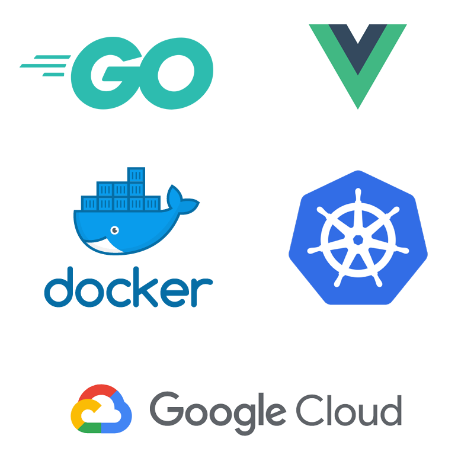

  <h2>Kubernetes docker experiments (珍珠奶茶 experiments)</h2>
  

## Structure of the project

- api/*.go (The back-end will be there made in GoLang)
- front/*.js (The front-end will be there made with ReactJS)
- docker/ (The list of dockerfiles used to build the project)
- k8s/ (List of file regarding kubernetes)
- docker-compose.yml a simple docker-compose that will be use to organize our containers

## Prerequisites

- Docker
- GCloud
- Kubernetes cmd line

## Description

The goal of this web app is to list several informations regarding the available bubble tea around the world.

### Back-end

The back-end will provide 4 APIs in Go:

- Add a / multiple Bubble tea
- Remove a Bubble tea
- List the available Bubble tea
- Get the detail information of a Bubble tea

### Front-end

The front-end will be made in VueJS. This app will provide 3 views.

- The home view where you will be able to get the list of the bubble tea (search).
- The add view which will allow u to add bubble tea
- The detail view which will let u see the detail of a bubble tea

### Database

All of these data will be store in a postgres database

## Environment

### Docker

- 3 containers will be use

### Docker swarm

- We will try to deploy our application on docker swarm and see the difference between kubernetes & docker swarm

### Kubernetes

* One cluster will be available
* 2 set of containers
* * 1 for the back-end (each containe will have 2 pods ) maybe several timezone ?
* * 1 for the front-end (each container will have 2 pods) maybe several timezone ?
* * The database will run on Google Cloud SQL
* * Accessing the database we will use the Cloud SQL Proxy

## Inspiration

This project is inspired by the great repository of topheman [Docker experiments by Topheman](https://github.com/topheman/docker-experiments)

## Copyrights

All right reserved. Lulu dans ma rue