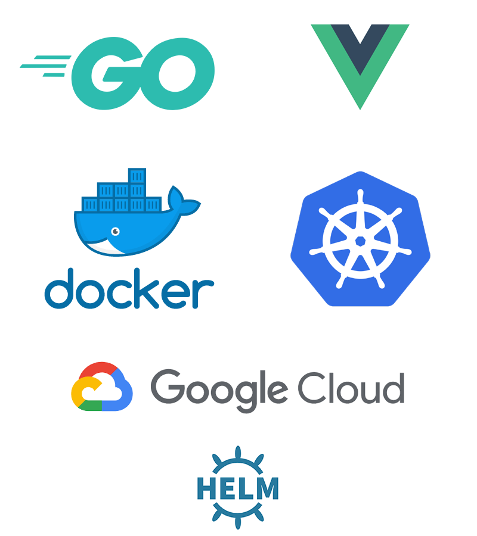

  <h2>Kubernetes docker experiments (珍珠奶茶 experiments)</h2>
  

# Introduction ✍️

Kubernetes is one of the most famous container orchestration. It allow you to deploy your container and scale it based on your needs throught several available components.

While Kubernetes is maintained by Google and other contributors, Kubernetes is available on multiple platform such as Aws and many more providers

# Example project 👨‍💻👩‍💻

In order to demonstrate the knowledges we learn throught this learning process. We are providing you with an example project that we're deploying together in Docker, Minikube but also within GCloud.

This example project contain the following parts:

- Backend in Golang
- Front-end in VueJS
- Database in MySQL

# Overview 💪

Kubernetes is a complex piece of software. Therefore it's essential for anybody to learn a minimum set of knowledges before being able to do anything on Kubernetes.

Moreover it's important to know how to use Docker. Indeed Kubernetes is managing container and Docker is one of the most popular container system out there.

> Disclaimer: We're far from being an expert in Kubernetes. However face to the complexity of Kubernetes we want to provide a simple way of learning Kubernetes from a web developer point of view.

* [Docker](docker/intro.md)
* [Kubernetes](k8s/intro.md)
* [GCP](gcp/intro.md)

# Inspiration 📖

This project is inspired by the great repository of topheman [Docker experiments by Topheman](https://github.com/topheman/docker-experiments)

# Copyrights

All right reserved. Lulu dans ma rue
