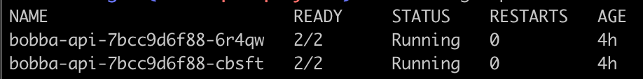

Before deploying the front we'll firstly deploy the API. Indeed we want to make sure that our API is working properly.

## Let's deploy 📤

Previously we'd create the images for kubernetes which are now stored within GCP. We also create our Database and the CloudSQL Proxy which is going to be use as a sidecar by our main application.

Now let's deploy our application on GCP.

Remember how we deploy our application with minikube ? Well for GCP this is going to be the same ! but with one difference regarding our configuration file for our deployment. Let's take a look at what we change.

- First we have concat our service & deployment in the same file with the seperator ```---```
- We have change our ```ImagePullPolicy``` with the one below 

```yaml
# If the image is already present Kubernetes won't pull it 
imagePullPolicy: IfNotPresent
```

- Thirdly we had change the image so that it point to the one stored in GCP

```yaml
image: gcr.io/<project_name>/sesame_api:v1
```

So now let's deploy. Run this command below

```shell
kubectl create -f gcp/deployment/api.yml
```

If everything is running correctly. Run the command

```shell
kubectl get pods
```

You should see 2 pods with 2 container on it like the screen below

<p align="center"> 
  
</p>

Now we need to take care off something important. Indeed with minikube we only had 1 Cluster and most importantly **1 Node**. Which is not the cased in our deployment. Indeed if you run the command

```shell
kubectl get nodes --output wide
```

You should see a list of 3 nodes with an ExternalIP which you can reach the API throughout the NodePort (31320)

#### In this case we'll use Ingress resources that will help us to Load balance our Nodes [Configuring Ingress](ingress.md)

