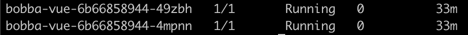

Like the API we will deploy the front in the same way

Run the command below which should looks like what we did with Minikube

```shell
kubectl create -f gcp/deployment/front.yml 
```

If everything is running correctly. Run the command

```shell
kubectl get pods
```

And you should see the list of pods related to your deployments like the image below

<p align="center"> 
  
</p>

**Wait a few minutes** ...

And run the command

```shell
# svc is an alias for services
kubectl get svc 
```

You should get the list of available services. And most notably an ExternalIP for our LoadBalancer that use the ```front``` project like the screen below

<p align="center"> 
  
</p>

#### And now with the ```LoadBalancer address``` you should be able to access to the website by your browser !
