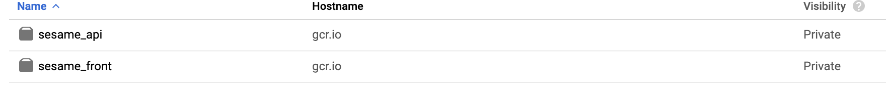

## Create our docker image for the Front 🖼️

This is the same process as for the API image

## Creating our Front image ⚒️

Before building our Front image we're going to update the file ```request.js```

Update the **URI** section and replace the value ```<EXTERNAL_IP_ADDR>``` by the ```external ip address``` that we'd just generated.

Now we can build the image. The command that need to be run should looks like to what we'd saw when we deploy our API to minikube.

```shell
docker build -t sesame_front -f build/node/Dockerfile.release <path to root folder>/kubernetes-docker-lab
```

Now tag the images with a version so that we can define a special version to use for our Deployment.

```shell
docker tag sesame_front gcr.io/<project_name>/sesame_front:v2
```

Finally push your image into GCR

```shell
docker push gcr.io/<project_name>/sesame_front:v2
```

## Check our image

Now let's check that are being stored into GCP.
- Go to the **Container registry** section
- Click on the **images** options, you should see the images like the image below

<p align="center">
  
</p>

#### Let's move on and [deploy the front](deployment_front.md)