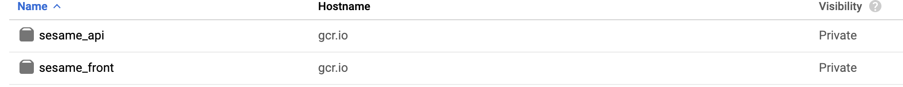

## Create our docker images

As we did with Minikube. We also need to create a set of Docker images in order to make them deployable to GCP with one noticeable differences. These images will be deployed to GCP and thus, store into GCP. Let's do it.

## Creating our Front image

Like with Minikube run the command below from the root of the project

```shell
docker build -t sesame_front -f build/node/Dockerfile.release <path to root folder>/kubernetes-docker-lab
```

Now tag the images with a version so that we can define a special version to use for our Deployment.

```shell
docker tag sesame_front gcr.io/<project_name>/sesame_front:v1
```

Add the gcloud config to Docker by running the command below

```shell
gcloud auth configure-docker
```

Finally push your image into GCR

```shell
docker push gcr.io/<project_name>/sesame_front:v1
```

## Creating our API image

This is the same process as the Front image

```shell
docker build -t sesame_api -f build/api/Dockerfile.release <path to root folder>/kubernetes-docker-lab
```

Now tag the images with a version so that we can define a special version to use for our Deployment.

```shell
docker tag sesame_api gcr.io/<projet_name>/sesame_api:v1
```

Finally push your image into GCR

```shell
docker push gcr.io/<project_name>/sesame_api:v1
```

## Check our images

Now let's check that are being stored into GCP.
- Go to the **Container registry** section
- Click on the **images** options, you should see the images like the image below

<p align="center">
  
</p>

#### All right let's move on to the exciting part. [Deploying our application !](deployment.md)