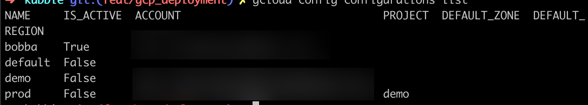

## Introduction

We saw how to deploy our small project with Docker. We also saw how to deploy our project on a local Kubernetes cluster by using Minikube. Today we're going to deploy our project into a real environment, Google Cloud Platform.

## Why Google Cloud Platform

Along with Amazon EKS, Google Cloud Platform is one of the most popular deployment platform for Kubernetes. As it's one of the most used we thought that it would have been interesting for you to learn how to deploy your app on it. Futhermore GCP offer you a $300 on 12months for beginning your journey into GCP. Thus it's free for you to use during this timespan.

## Configuration

If you'd follow the previous tutorial on how to deploy your app with Minikube then you shouldn't be lost. This deployment is going to be pretty much the same. Otherwise I highly suggest you to read the previous set of tutorial on [how to deploy an app with Minikube](../k8s/deployment/example.md)

> Before diving into the Google Cloud Platform you need to have obviously a Google account and already have create a Google Cloud Project. If not check how to create a google cloud project [here](https://cloud.google.com/resource-manager/docs/creating-managing-projects)

### Requirements

Deploying into GCP required you to have installed the components lists below:

- GCloud SDK
- Kubectl
- Docker
- Your favorite editor (vscode, vim, emacs, nano, sublime up to you... maybe Microsoft Word ?)

### Configure GCloud SDK

If you have already installed & configure GCloud SDK you can skip this section.

Kubectl required an environment context for searching our clusters. In order to do that we need to sync our GCloud SDK so that the Kubectl environment will be sync with our project.

First, let's create a gcloud configurations by running this command:

```shell
gcloud config configurations create bobba
```

If you run the command

```shell
gcloud config configurations list
```

You should see a list of config like the image below

<p align="center">
  
</p>

Now your configurations is created. However it's not activate yet.
Let's activate it by running this command

```shell
gcloud config configurations activate bobba
```

And the final step. Log into GCloud so that you can retrieve your cluster for later use.

```shell
gcloud auth login
```

### Configure your cluster

If you already have and know how to create a Cluster into GCP, you can also skip this section.