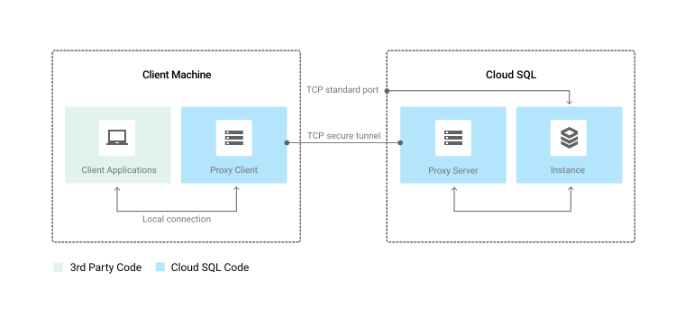

## CloudSQL Proxy 🚧

Previously in our SQL article we saw how to implement a CloudSQL Proxy in our pods. Now it's time to see how and how does it work.

CloudSQL proxy should offer much more advantages than the private IP. Here are Google's arguments regarding this subject

> Secure connections: The proxy automatically encrypts traffic to and from the database using TLS 1.2 with a 128-bit AES cipher; SSL certificates are used to verify client and server identities.

> Easier connection management: The proxy handles authentication with Cloud SQL, removing the need to provide static IP addresses.

```shell
Note that the Proxy relies on an existing IP connectivity.
```

### How does it work

<p align="center">
  
</p>
<p align="center">Image from gcloud doc, Google.</p>

The diagram show pretty simply how the CloudSQL Proxy works.

In your pods you have a proxy client (sidecar container) which is used by your application. 
- When your application will send a database request. 
- Your application will call the client proxy 
- The client proxy will safely send a request to the proxy server which in turn will call the database instance.
- The communication between your apps & the sql instance is all done throught the set of proxies. (client & server)

For more detailed on the different options of cloudSQL-proxy take a look at the [google documentation](https://cloud.google.com/sql/docs/mysql/sql-proxy?hl=en)

#### Sidecar

CloudSQL Proxy come with a seperate image that's going to be installed as a sidecar in your pod. In order to understand what a Sidecar is. Take a look to the related article [What's a sidecar](../k8s/architecture.md#Pod).

## Resources 📕

[Google documentation](https://cloud.google.com/sql/docs/mysql/sql-proxy?hl=en)

