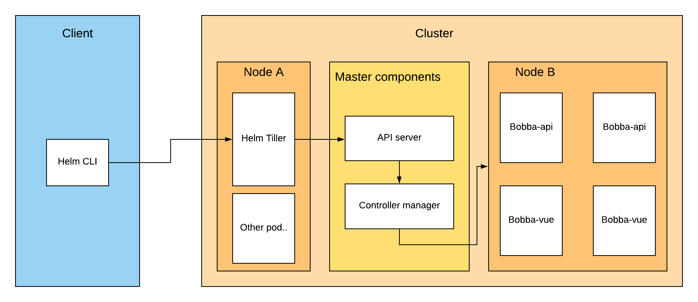

## Helm's components

Helm is a package manager which is made of 2 parts:

- client
- tiller

### Client

The helm's client is a CLI app that's coupled to the ```kubectl``` configuration. Indeed the helm's CLI will allow you to trigger some action that are going to be trigger by the ```tiller```.

### Tiller

The tiller is a pod which is running in your Kubernetes cluster. This tiller will actually communicate with the ```api-server```.

The role of this tiller is to deploy your Helm chart into Kubernetes by communicating with api-server. It's abstracting the headache of deploying a service, deployment and other things for you...

We can sum up the architecture of Helm like below

<p align="center">
  
</p>
<p align="center"><b>Helm global architecture</b></p>

## Helm's chart structure

Creating a chart is easy just run the command

```shell
helm create <char_name>
```

Helm will create a chart with already some examples files that you could re-use in for easily create your deployment. For the sake of this article the needed charts are already provided.

The structure of a chart is define like below

- Chart.yaml --> Information about your chart
- requirements.yaml --> Optional, listing the dependencies of your chart
- values.yaml --> Default values files use for hydrating your template files
- templates/*.yaml --> Directory where your charts are stored
- templates/NOTES.txt --> Optional, file use for describing your chart during installation (e.g can show which command to run for debugging etc..)
- charts --> Directory where your subchart are stored (dependencies)
