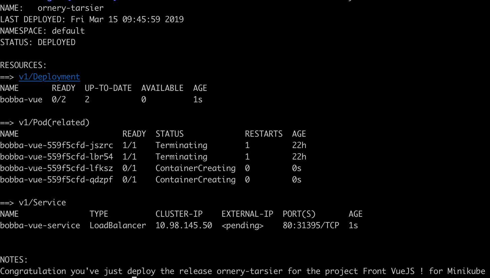

## Creating our Bobba-charts

As describe earlier Helm is composed of charts which can be download and configure easily. In our case for the purpose of learning Helm we'll make our own charts.

Before beginning our journey into the world of chart of Helm. I highly suggest you to check the [templating syntax of Helm](https://helm.sh/docs/chart_template_guide/#getting-started-with-a-chart-template)

## Creating our template for Minikube

Helm templates folder can contain many ```yaml``` files. In our project which are:

- bobba-vue
- bobba-api

We have 2 commons components which are:

- Deployment.yaml
- Service.yaml

Thus thanks to the templating system of Helm we could gather these common components together in 1 generic component.

The yaml file is available in the folder ```bobba-helm-chart/templates/deploymen.yaml```. 

As these deployment are similar the technic is to create 2 distinc ```Values``` files.

These values will be used by the ```deployment.yaml``` template file which will then be render by the tiller.

Thus we have a generic yaml file like below. Special case for either deployment case are handle by a conditonal ```if```

```yaml
# Deployment for the api
apiVersion: apps/v1
kind: Deployment
metadata:
  name: {{ .Values.deployment.name }}
  labels:
    helm.sh/chart: {{ include "bobba-helm-chart.chart" . }}
    app: {{ .Values.deployment.name }}
    tier: {{ .Values.deployment.tier }}
spec:
  replicas: {{ .Values.deployment.replicasCount }}
  selector:
    matchLabels:
      helm.sh/chart: {{ include "bobba-helm-chart.chart" . }}
      app: {{ .Values.deployment.name }}
      tier: {{ .Values.deployment.tier }}
  template:
    metadata:
      labels:
        helm.sh/chart: {{ include "bobba-helm-chart.chart" . }}
        app: {{ .Values.deployment.name }}
        tier: {{ .Values.deployment.tier }}
    spec:
      containers:
        - name: {{ .Values.deployment.name }}
          {{- if .Values.env }}
          env: {{- include "bobba-helm-chart.environment" . | nindent 12 }}
          {{- end }}
          image: "{{ .Values.image.repository }}:{{ .Values.image.tag }}"
          imagePullPolicy: {{ .Values.image.pullPolicy }}
          ports:
            - name: http
              containerPort: {{ .Values.deployment.port }}
              protocol: TCP
          {{- if .Values.deployment.args }}
            {{- include "bobba-helm-chart.startup" . | nindent 10 }}
          {{- end }}
```

Our template is full of mustache templating. This is indeed due to the Go's templating language which Helm is based on. In order for you to fully understand the template below is a list of directives that what we'd used for defining our template. 

### Variables

```yaml
foo: {{ .Values.deployment.name }}
# This referer to the variables deployment.name which are in the values-{type}.yaml. We use the "." in order to precise the namespace e.g

# .Values represent the value file (values-{type}.yaml)

# .Values.deployment, "deployment" represent a value named "deployment" in our yaml file

# .Values.deployment.name, "name" represent a value named "name" which is in our yaml file but is a child of the value "deployment" which is it's parent
```

### Include a partial templates

Sometimes it can be handful to include an other set of yaml file in order to make your deployment much more readable. You could consider this ```include``` as including a *partial template* into your main template file.

```yaml
{{- include "bobba-helm-chart.environment" . | nindent 12 }}

# In your partial template
{{- define "bobba-helm-chart.environment" -}}
- name: DEPLOYMENT
  value: minikube
{{- end -}}
```

> Note: You could use the keyword ```template```. However as per the Helm documentation is preferable to use the include keyword than the template.

> Per Helm's documentation: It is considered preferable to use include over template in Helm templates simply so that the output formatting can be handled better for YAML documents.

### Conditional

A condition could be useful for handling a special case e.g overriding the default Docker's image args for your Deployment object. This can be done like below

```yaml
# This mean, if the deployment.args variable exist then execute the condition 
{{- if .Values.deployment.args }}
  # Do something
{{- end }}
```

### Whitespace

Yaml is kinda case sensitive. Thus whitespacing can be quite an issue. Thankfully Helm is providing a simple way of dealing with whitespace.

the ```-``` operator could be use in order to remove the whitespace. e.g

```yaml
dish: {{- .Values.lao.papayaSalad }}
```

### Pipes

Helm is also supporting a feature which is inherited by the Go templating system. This function is the ```pipe``` feature. This feature allow you to interpolate your values with several pipes operator. e.g you want to add quotes to your values.

This can be done like below

```yaml
fname: {{ .Values.author.fname | quote }}
# This would output: fname: "marc"
```

## Services

As we just see, the templating has basically the same format as the real deployment but instead of using a real values we're using templating values.
Well for the services this is the same ! It's even more straightforward as it's much more shorter. 

Below is the service which you could also found in the folder  ```bobba-helm-chart/templates/service.yaml```

```yaml
# Service configuration
apiVersion: v1
kind: Service
metadata:
  name: {{ .Values.service.name }}
  labels:
    helm.sh/chart: {{ include "bobba-helm-chart.chart" . }}
    app.kubernetes.io/instance: {{ .Release.Name }}
    app.kubernetes.io/managed-by: {{ .Release.Service }}
spec:
  type: {{ .Values.service.type }}
  ports:
    - port: {{ .Values.service.port }}
      targetPort: {{ .Values.service.targetPort }}
      protocol: TCP
      {{- if .Values.service.nodePort }}
      nodePort: {{ .Values.service.nodePort }}
      {{- end }}
  selector:
    helm.sh/chart: {{ include "bobba-helm-chart.chart" . }}
    app: {{ .Values.deployment.app }}
    tier: {{ .Values.deployment.tier }}
```

All right now that we've create our yaml template file for both of the bobba-api & the bobba-vue project let's test it.

## Testing

Helm is providing a command for you to test your configuration. This command will return errors if something is wrong with your configurations files. It'll also show you the entire rendered yaml files which are going to be send to the ```tiller```. Below is the command

```shell
helm install --debug --dry-run -f <path_to_values.yaml> <path_to_chart>

# In our example
helm install --debug --dry-run -f bobba-helm-chart/values-api.yaml ./bobba-helm-chart
```

Let's explain this command

- helm install: will send your charts to the tiller for installation
- --debug --dry-run: will not installed but print the result of the charts
- -f <file>: allow you to select a different ```values``` file. (By default it use the ```values.yaml``` file)
- ./bobba-helm-chart: the name of the chart

## Installing the front

As you can see we'd just use the ```debug``` mode for running our chart. Installing is then no more simpler than running the command without using the ```--debug --dry-run``` command.

```shell
helm install -f <path_to_values.yaml> <charts>

# In our example
helm install -f bobba-helm-chart/values-front.yaml ./bobba-helm-chart
```

When the installation is successfull a sucessfull message will appear with the list of objects that has been deployed into Kubernetes as well with the release name. Below is a screenshot of what it could look like

<p align="center">
  
</p>
<p align="center"><b>Helm deploying bobba-vue</b></p>

## Installing the back-end

Installing the back-end will be done later as we need a dependencies.