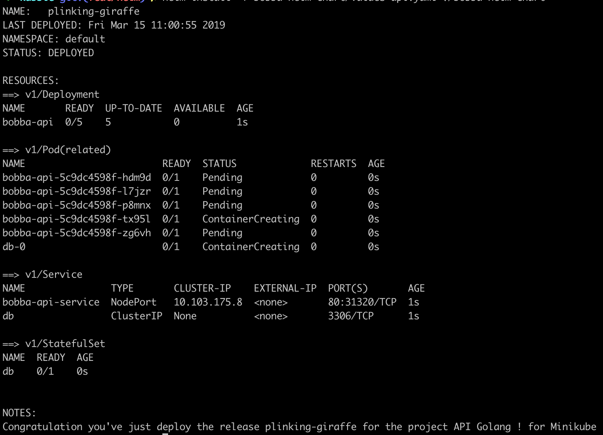

## Creating our Bobba-db chart

We have create our chart for our front-end & back-end application which is a good start. 

In the context of Minikube we also have an additional project to deploy. This project is the database. The database contains the following components:

- statefulSet.yaml
- services.yaml

These files could be integrated straight away into our project isn't it ? However this has one drawback. Indeed this drawback is that the database will be deploy along side with the front-end.

Futhermore this will make our current chart too monolithic as we'd need to alter our current services in order to support the Database service albeit this would have been a slight change.

Fortunately Helm chart is supporting ```subchart``` which could be controlled by using a ```requirements.yaml```. 

This ```requirements.yaml``` in a few words list your dependencies and let you define conditional action for these dependencies such as installing it or not.

## Creating a subchart

For our database we're going to create a subchart which will only be use when deploying the *bobba-api project (backend)*

A subchart live in the ```charts``` folder which is located like so: ```<main_chart_folder>/charts``` For creating a new subchart go to this folder and you can do the command ```helm create <char_name>```.

For the purpose of this demo project the subchart of the database is already provided.

The subchart that we're going to take a look is named ```bobba-db-chart```.

The structure is basically the same as the main chart but contain specific rules that are related for the database. In this chart we can find these files

- stateful.yaml
- service.yaml
- volumes.yaml (partial)

As the templating should be straightforward like the previous one. I'll let you understand these charts by yourself 😎

*Note: Variable from parent are inherited by the children chart*

## Adding a constraint to our chart

In order to limit the database chart installation to only the ```bobba-api``` project we'll use a ```requirements.yaml``` which will be located in the main chart folder.

An already provided ```requirements.yaml``` is already available. Let's take a look at how is it

```yaml
dependencies:
- name: bobba-db-chart
  version: 0.1.0
  condition: db.enabled
  repository: file://%
```

As you can see the definition is pretty straightforward what we're going to focus is on the ```condition``` field.

The condition field allow us to define when the dependencies should be installed. the variable ```db.enabled``` is located within your ```values.yaml``` file or whichever values files you're providing to Helm.

As an example the ```values-api.yaml``` contain this definition

```yaml
# database activation
db:
  enabled: true
```

And in the ```values-front.yaml```

```yaml
# database activation
db:
  enabled: false
```

## Installing

Like for the ```bobba-vue```. We'll first make a dry test run of our chart to check any error any error in our deployment. Run the command below

```shell
helm install --debug --dry-run -f bobba-helm-chart/values-api.yaml ./bobba-helm-chart
```

If you don't see any error run the command

```shell
helm install -f bobba-helm-chart/values-api.yaml ./bobba-helm-chart
```

You should get an output similar to the image below

<p align="center">
  
</p>
<p align="center"><b>Helm deploying bobba-api</b></p>


