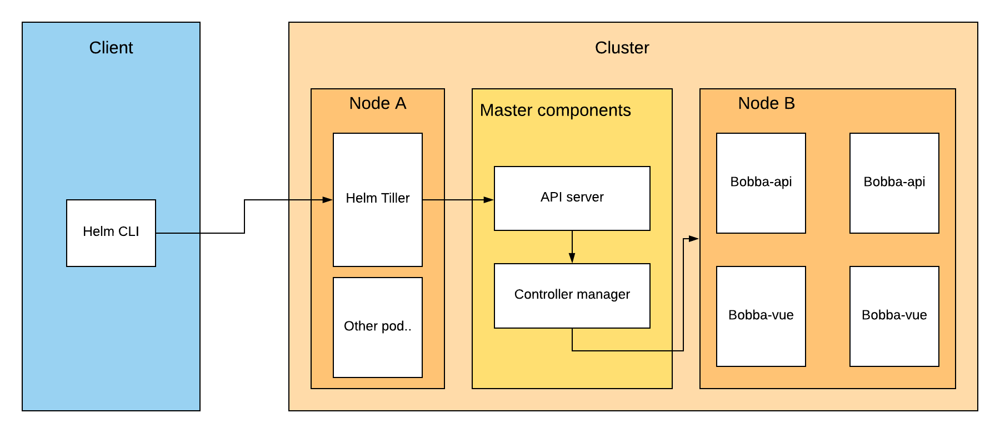

## Helm's components

Helm is a package manager which is made of 2 parts:

- client
- tiller

### Client

The helm's client is a CLI app that's coupled to the ```kubectl``` configuration. Indeed the helm's CLI will allow you to trigger some action that are going to be trigger by the ```tiller```.

### Tiller

The tiller is a pod which is running in your Kubernetes cluster. This tiller will actually communicate with the ```api-server```.

The role of this tiller is to deploy your Helm chart into Kubernetes by communicating with api-server. It's abstracting the headache of deploying a service, deployment and other things for you...

We can sum up the architecture of Helm like below

<p align="center">
  
</p>
<p align="center"><b>Helm global architecture</b></p>