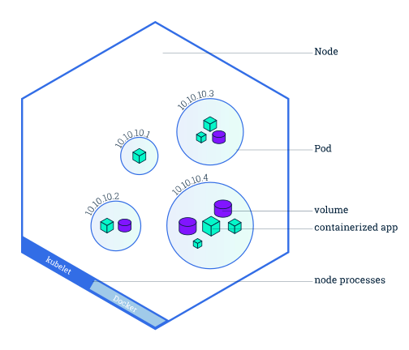

## Architecture ⚙️

In this article we'll take a look at Kubernetes's architecture. This will enable us to understand how Kubernetes is working.

## Type of architecture 🔍

Kubernetes is based on the master-slave architecture.
A master-slave architecture is a type of architecture where the ```master``` components decide the actions which will influence the task that will do ```slave``` components.

Within Kubernetes the ```master``` is name ```master components```. Slaves components are named ```node components```.

Within each of these layers there are multiples components that we'll look into. These components are represented within this schema below  🛠️:

<p align="center">
  
</p>
<p align="center"><b>Kubernetes architecture</b></p>

## Components 🛠️

### Cluster

The cluster is a environment where you're deploying your application. It contain the master components as well as multiples nodes which are direct by the master components.

```
It's possible to create a virtual Cluster called Namespace. It's used for application where the load is important which is not the case for this learning tutorial
```

Below is the representation of the cluster

<p align="center">
  
</p>
<p align="center"><b>Cluster representation, Kubernetes documentation</b></p>

### Master components ⚙️

Master components are a set of components which are running within the Cluster. These master components are pretty much the brain of the Cluster and therefore are critical components to Kubernetes.

#### Kube-api-server 

Kube-api-server is a critial component of the Kubernetes architecture. The Kube-api-server is an API use by every components of the **master components**. It's also use by the kubelet process which is located in the Node.

So how does it works ❔. Kube-api-server is a simple REST API which it's main purposes is to validate, saving Kubernetes's cluster state. It's also use for saving metadata, configuration of your pods & services

As Kube-api-server is stateless (does not save any datas). Kube-api-server is tightly coupled to an external database component also located in the *master* named **Etcd**. See etcd section for more information.

In order to understand how crucial Kube-api-server is important. Please take a look at the schema below:

<p align="center">
    
</p>
<p align="center"><b>Create Pod Flow: Source: heptio.com</b></p>

#### Etcd

Etcd is a high performance key value database written in Go. This database is only use by kube-api-server in order to save the state of the cluster of your cluster. I suggest you to read this good article about what does Etcd: [How kubernetes use etcd](https://matthewpalmer.net/kubernetes-app-developer/articles/how-does-kubernetes-use-etcd.html)

Moreover if you're curious about how works Etcd you could check the repo [Etcd repo](https://github.com/etcd-io/etcd)

#### Controller manager

The controller manager is a daemon (a background process) which is located on the master. 

What it does is that it watches for any changes on the state of the cluster by querying ```kube-api-server```. If any changes happened the controller manager will move the current state to the desired state. 

The controller manager is actually a list of several controller launch in a single process 
the list of controllers use by the controller manager is available [over here](https://github.com/kubernetes/kubernetes/blob/6671d2556f1af67e703c329b1186896d7c6f9f4d/cmd/kube-controller-manager/app/controllermanager.go#L339)

For a full technical description of the controller here is the definition right from the Kubernetes documentation: 

> In Kubernetes, a controller is a control loop that watches the shared state of the cluster through the API server and makes changes attempting to move the current state towards the desired state. Examples of controllers that ship with Kubernetes today are the replication controller, endpoints controller, namespace controller, and serviceaccounts controller.

#### Scheduler

The scheduler is an other component of the **master component**. It's task is to watch for unscheduled pod. When an unscheduled pod pops up, the scheduler will try to find the proper node. It will try to to bind to a node it depending on several criteria

Binding an unscheduled pod to a node happened through the ```/binding``` subresources. While this seems to be a bit obscure an article with tremendous amount of knowledges regarding the Scheduler is avalaible [here](https://kublr.com/blog/implementing-advanced-scheduling-techniques-with-kubernetes/)

#### Cloud controller manager

The cloud controller manager is a manager for cloud specific control loops. This controller manager allow cloud provider to make their own set of controller while satisfying the cloud controller interfaces. (E.g, a foo cloud provider implement their own node controller)

A list of available controller is available here: [Cloud controller manager](https://github.com/kubernetes/kubernetes/blob/6671d2556f1af67e703c329b1186896d7c6f9f4d/cmd/cloud-controller-manager/app/controllermanager.go#L270)

### Node components

Node components refer to the components running into a Node. A Node is the second layer of Kubernetes (slave in the master-slave architecture) where your pods are running. Pods are controlled and monitored by Kubelet

<p align="center"> 
  
</p>
<p align="center"><b>Representation of a Node. Kubernetes documentation</b></p>

#### Kubelet

The kubelet is the main component of the Node which is located on each Node.

It's purpose is to watch continuously the state of the pods and to send these information such as monitoring back to the kube-api-server. Kubelet is also responsible at taking the proper action if something happened to a pod e.g: restarting a pod when a pod is getting shutdown.

TL;DR Kubelet is responsible of:

- Run the pods container on the right engine
- Restart the pod if failure happened
- Report status of the node and each pod to kube api-server
- Retrieve metrics from the pods container

#### Kube proxy

The Kube proxy is a component which it's purpose is to watch changes in the definition of the service of the pods in order to maintain the desired network configuration by querying kube-api-server. 

This component also expose the pod to the correct back-end which allow you to exposes the pods by manipulating the iptables and assigning IP addresses so that you can easily access to your pods

#### Container runtime

The container runtime is the engine use for running the container pod. E.g: docker, rkt and many more...

## Resources used

[Description of kubernetes architecture](https://elastisys.com/wp-content/uploads/2018/01/kubernetes-ha-setup.pdf?x83281)

[Kubernetes documentation](https://kubernetes.io/docs/concepts/overview/components/)

[Learning kubernetes architetcture](https://medium.com/jorgeacetozi/kubernetes-master-components-etcd-api-server-controller-manager-and-scheduler-3a0179fc8186)

[Scheduler detailed explanation](https://kublr.com/blog/implementing-advanced-scheduling-techniques-with-kubernetes/)

[Creating it's own controller](https://engineering.bitnami.com/articles/a-deep-dive-into-kubernetes-controllers.html)
