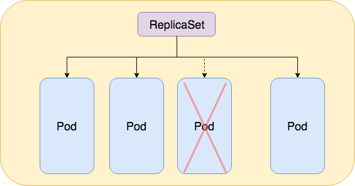

## Deployment 🚀

In this article we'll talk about the different type of deployment named Controller in Kubernetes

## Controllers ⚡

As of Feburary 2019, Kubernetes provide several types of Controllers. 

```
These controller are part of the kube-controller-manager
```

- ReplicaSet
- ReplicationController
- StatefulSets
- DaemonSet
- TTL Controller (see documentation as it's in alpha)
- CronJob

### ReplicaSet

ReplicaSet is a type of controller that aim to surpass the previous ReplicationController. It can be used if you need to maintain a stable amount of replica Pods running at anytime.

Futhermore ReplicaSet will monitor the status of each pods and create a new one if one of them happened to failed or lost.

Note that ReplicaSet is also ship with additional functionnalities. I suggest you to check the Kubernetes documentation as well as the **Explanation of ReplicaSet article** on the resources section

<p align="center">
    
  <p align="center"><b>ReplicaSet schema, Jiamin Ning, Medium article.</b></p>
</p>

### ReplicationController

ReplicationController is actually an older version of ReplicaSet. While their purposes are the same they work differently ReplicationController does not support set based selector. 

It's therefore recommended by Kubernetes to use the **ReplicaSet** instead of the **ReplicationController**

### StatefulSets

StatefulSets is a kind of controller that has the same capabilities as the ReplicaSet. However one major difference is that the StatefulSets is able to use a storage which can be use for storing datas without losing when pods are restarted / destroyed. 

This kind of deployment is useful for statful application e.g: a photoshop application

Note: You could setup a database with Kubernetes by using this option. However database resources can grow rapidly which a container is at some point limited. However for the purposes of the demo we will use it

### DaemonSets

A DaemonSet is a kind of controller that will deploy a pod into each Node that exist on the cluster. If a node get removed then the DaemonSet pod will get garbage collected.

Moreover DaemonSet automatically scale based on the number of Nodes available.

This kind of deployment can be useful for many type of application such as **logs collections**, **monitoring tools**

## API Objects 📜

API Object are wrappers around the controllers describe above. It add additional functionnality to them. Below is the list of available API Object available in Kubernetes:

- Deployments
- Job
- CronJob

### Deployment

Deployment is an API Object that leverage the ReplicaSet controller by bringing additional feature such as:

- Create a deployment to Rollout a ReplicaSet: Creating ReplicaSet in background and monitor the status to see if it succeed.
- Declare new state of the pods by updating the template spec: This will allow Kubernetes to create a new type of ReplicaSet and to replace the old ones on the fly
- Rollabck to an earlier version of a Deployment
- Scale up the deployment
- Pause the deployment
- Cleanup older ReplicaSets that we don't need anymore

Thus it's recommanded to use the **Deployment** instead of using the **controller** directly.

### Job

A Job is a kind of controller that allow you to run a number of pods. It allow you to create several pod, tracks it's completion and set a number of pod that need to be succeed in order for the Job to be considered as complete. In case of a failure the job will recreate an additional pod.

Job can be use to run conccurent pod. (parallelism). A special kind of Job named CronJob exist and is based on the Job controller

### CronJob

CronJob allow you to run a number of pod's replica at a certain amount of time. Like the Jobs the CronJob will attempt to recreate a numbers of pods if one of them fail. I suggest you to take a look at the CronJob section.

## Resources

[Explanation of ReplicaSet](https://medium.com/@jiamin_ning/build-your-first-kubernetes-service-with-replicaset-7c37d9be689c)

[Kubernetes ReplicaSet documentation](https://kubernetes.io/docs/concepts/workloads/controllers/replicaset/)

[DaemonSet explanation by a GCP Developer](https://medium.com/google-cloud/kubernetes-run-a-pod-per-node-with-daemon-sets-f77ce3f36bf1)

[Job & CronJob explanation](https://codeblog.dotsandbrackets.com/one-off-kubernetes-jobs/)

[TTL Controller](https://kubernetes.io/docs/concepts/workloads/controllers/ttlafterfinished/)

