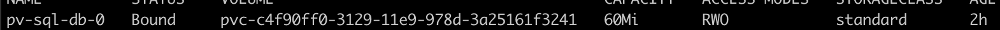

# Database

Previously we saw one type of deployment. This deployment was what we call ```stateless``` this mean that when pods restarting we loose the ```datas``` that are written in the pods.

Kubernetes provide an other kind of deployment. This one is name ```StatefulSet``` as you can imagine this kind of deployment allow us to keep the state of our pods continually

# Creating the Docker image

First we will create the MySQL image for minikube. Within this image we provide the **environment** variables & the MySQL dump file.

The Dockerfile is available in the ```build/db``` folder

```shell
docker build -t sesame_db -f build/db/Dockerfile <path to root folder>/kubernetes-docker-lab
```

Once you build the image check that the image is availble with the command ```docker images```

Ok let's move on and create our service & configuration file for Kubernetes

# Creating our services

This is the service use by the database statefulset deployment

```yaml
kind: Service
apiVersion: v1
metadata:
  name: db
spec:
  # Disable the cluster ip
  clusterIP: None
  selector:
    app: db
    tier: database
  ports:
  # Expose outside of the cluster
  - protocol: TCP
    # port expose to the cluster
    port: 3306
    # Port of the pods
    targetPort: 3306
```

As you can see it's pretty much the same object as the other kind of service with one big difference. We're disabling the ClusterIP. 

As per Kubernetes documentation for a StatefulSet type of deployment it's recommended to disable it for the reason cited below:

> Sometimes you don’t need or want load-balancing and a single service IP. In this case, you can create “headless” services by specifying "None" for the cluster IP (.spec.clusterIP).

> This option allows developers to reduce coupling to the Kubernetes system by allowing them freedom to do discovery their own way. Applications can still use a self-registration pattern and adapters for other discovery systems could easily be built upon this API.

> For such Services, a cluster IP is not allocated, kube-proxy does not handle these services, and there is no load balancing or proxying done by the platform for them. How DNS is automatically configured depends on whether the service has selectors defined.

TL;DR: Disable the load balancing or the proxiyng for decoupling the usage of the StatefulSets. The service can still be accessible by the DNS depending on how you configure the selectors

In our example we have defined selectors which make our service available to other pods by using the selector which act as a DNS

# Creating our StatefulSet config

As we said earlier ```StatefulSet``` will be the kind of deployment that we're going to use.

The deployment file is available in the ```k8s/db_deployment.yml```

But let me explain the configuration file

```yaml
# Version of the APi
apiVersion: apps/v1
# Defining the kind of deployment
kind: StatefulSet
# Set the metadata that'll be use by the services
metadata:
  name: db
  labels:
    app: db
    tier: database
# Definition of what's going to contain our StatefulSet
spec:
  replicas: 1
  selector:
    matchLabels:
      app: db
      tier: database
  # Important: We match the service that we defined earlier
  serviceName: db
  template:
    metadata:
      labels:
        app: db
        tier: database
    spec:
      # Define our container
      containers:
      - name: db
        image: sesame_db:latest
        # We want to enforce the usage of a local docker image
        imagePullPolicy: Never
        ports:
          # Exposing the MySQL port
          - containerPort: 3306
        # Mount a volume name pv-sql
        volumeMounts:
          - name: pv-sql
            # We're mounting the volume to the folder where MySQL store the datas
            mountPath: /var/lib/mysql/
  # Define the volumes that will be use by the Pods
  volumeClaimTemplates:
    # Name of the volume
    - metadata: 
        name: pv-sql
      spec:
        # See the access mode section
        accessModes:
          - ReadWriteOnce
        resources:
          # Define the size
          requests:
            storage: 60Mi
```

Our configuration file has 2 parts:

* First, the configuration of the deployment & the container
* Definition of the stateful storage (optional)

In our case we need a database which act in a stateful way. In this case we'll need to add an external volumes which will be use by Kubernetes for persisting our datas. These volumes are linked to the related pod (in our case only one).

By defining this storage and by using the StatefulSet we're confident that when we update, delete, restart our deployment the datas won't be lost.

The definition of the storage is straightforward. StatefulSet allow you to define a Volume through the ```volumeClaimTemplates property```

```yaml
volumeClaimTemplates:
  # Name of the volume
  - metadata: 
      name: pv-sql
    spec:
      accessModes:
        - ReadWriteOnce
      resources:
        # Define the size
        requests:
          storage: 60Mi
```

Regarding the **access modes** I highly suggest you to take a look at this [article](https://kubernetes.io/docs/concepts/storage/persistent-volumes/#access-modes)

Later on you call your storage within the ```volumeMounts``` property of your container.

Now when you are launching the deployment with the command

```shell
kubectl create -f k8s/deployment/db_deployment.yml
```

You should see, if successfull your pods. And as you can see the pod don't have a random ID but an ID with a precise order which is due to the StatefulSet behavior.


You should also be able to see that a volume exist by using the command:

```shell
kubectl get pvc
```



Et voilà you have a database which is running !
