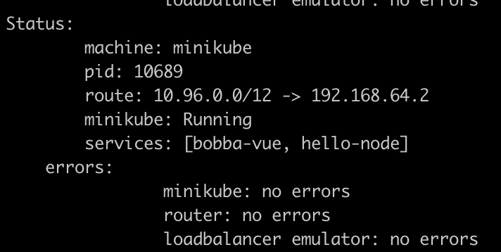

## Deployment exercise ⚙️

We saw many theorical information. Now it's time to apply these knowledges in a small project example. Today our example is a simple web app which need to be deploy with Kubernetes. Each layer of the app need to be deploy seperately within the same cluster due to Minikube's limitation.

- front: a small front-end made with VueJS
- back: a small back-end which contain Rest API made with Go
- database: a simple MySQL database with only one table

## How are we going to deploy this web app

Based on what we learn so far. We know that a cluster is made of several Nodes where in each of these Nodes there are multiples pods which are managed by the Kubelet. Moreover we also saw different kind of deployment that allow us to manage the behavior of our pods by using different type of controller.

- stateless: nothing is stored which can be useful for the api and the front
- we need to have the same amount of pods available so that if one fail the other can take the load
- for our convenience we need to be able to update, rollback our deployment if anything happened

Based on the types of deployment we know the one that fits the best is the ```deployment``` types at least for the front and the api.

## How about the database ?

Our database is a statefull kind of service. With Kubernetes we have the option to create a stateful service with the ```statefulSet``` controller. However the community is divide at the idea of running a database in Kubernetes.

A deep explanation has been made on the subreddit of Kubernetes. **Credits to nkrgovic for it's detailed explanation**

> Stateful services, especially databases, rely on keeping state on a reliable media - in most cases disk (ssd or spinning rust). Also, in most cases, database performance is a big issue affecting system performance. This is partly due to design, and partly due to inherent inability of relational databases to scale horizontally.

> Simple put, the most common bottleneck in databases is the disk performance. In order to get good database performance you need disk performance. This means predictable latency and good throughput - which usually means dedicated volumes with QoS, not sharing out of a pool.

> Other issues have to do with databases using a lot of memory, and also not being good to spin up and spin down new instances quickly, exactly because of the state: They need to copy the entire data set over and that takes time.

> When you put all those together a relational database is a very bad candidate for running in a container - it just doesn't make sense. If you have a lot of data spinning up and down, starting, everything takes time, and a lot of time.

> If you have a little bit of data, like in a test or CI environment, then database in a container is a great tool. But in a production environment databases and containers just don't mix.

Moreover Kelsey Hightower a developer advocate on the GCP advise to also not use Kubernetes for deploying a database. See his [tweet](https://twitter.com/kelseyhightower/status/963413508300812295?lang=en)

At first glance we thought that it would be a good idea to connect a local database hosted on your computer. However due to the network isolation that minikube does like Docker it wouldn't be possible to do this kind of infrastructure. Futhermore this is only a small database with one table for testing purposes. Thus deploying the database within the Kubernetes environment is not a big issue.

## Let's deploy !

Yes let's deploy first by deploying the [front-end](front.md). A link for the next part will be available on each of the next articles


## Accessing to the project

As you have a LoadBalancer available by running the ```minikube tunnel``` you should be able to access to the front-end by using the IP address that minikube has generated.

Minikube should have generate an address with a bitmask of 12 like the image below

<p align="center">
    
</p>

Now get the service of the front-end by running

```shell
kubectl get services
```

You should see the ```External IP``` for the bobba-vue services. Copy and paste it into your browser and you should be able to access to the front like the image below

<p align="center">
    
</p>

## CronTask

If you want to deploy a CronTask a guide based on our example is available [here](cron.md)

## Cleanup 🔌

Now that you have finish the deployment it's important to cleanup it's workspace.

First remove the services by running this command

```shell
kubectl delete service <service_name>
```

then delete the deployemnts

```shell
kubectl delete deployment <deployment_name>
```

then delete the stateful sets

```shell
kubectl delete statefulset <statefulset_name>
```

then delete the pvc sets

```shell
kubectl delete pvc <pvc_name>
```