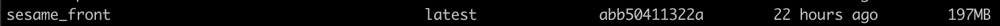

## Deploying the front-end 🦅

Deploying an application to Kubernetes required you to have at least those components

- a docker image
- a yaml deployment configuration file

We'll take a look at these components steps by steps

## Building our Docker image 🐣

As said earlier we're using the Docker runtime environment for our small deployment example. In order for minikube to be able to use the image. We will build a Docker image for the front-end.

A front-end Dockerfile is available for the example. It's pretty simple we create the folder, copy the project and the start.sh will be the script which will install the npm dependencies & run the project.

Run the command below from the root of the project. This will build a docker image for the front-end

```shell
docker build -t sesame_front -f build/node/Dockerfile.release <path to root folder>/kubernetes-docker-lab
```

What this command does ? 🤔

- We ask docker to build an image wit the options
- ```-t``` we provide the name in this case sesame_front
- ```-f``` We're providing the context of building the dockerfile. In this case from the root folder

Once the image is build run the command ```docker images```. and you should see the docker image available in the list of images like below. Houra ! 😁

<p align="center">
  
</p>

## Create the deployment configuration 🐥

Our front-end application is a stateless app. Indeed we're storing nothing on our pods. Therefore the most suitable type of deployment is the ```Deployment``` type. 

As configurating the yaml file can be a bit complex we're providing the front-end yaml deployment file. Below is how it looks with some information about each fields. The deployment file is available in the folder ```k8s/deployment/front_deployment```

```yaml
apiVersion: apps/v1
# This is the type of deployment we talked earlier
kind: Deployment
# Defining metadata allow us to recognize our application easily (can be use by external tools such as Stackdriver, kubectl)
metadata:
  # Name of your deployment
  name: bobba-vue
  # A set of identifier that can help you to identify the pods
  labels:
    app: bobba-vue
    tier: frontend
# Spec is where you are configuring your deployment
spec:
  # number of replicas
  replicas: 2
  # Selector is use for the deployment to apply to the pod
  # Using matchLabels it must match at least one of the label defined earlier
  selector:
    matchLabels:
      app: bobba-vue
    # Definition of your pod here
    template:
      metadata:
        labels:
          app: bobba-vue
      spec:
        containers:
          - name: bobba-vue
            image: sesame_front:latest
            # This line enabled us to use a local image and not to fetch one coming from a server
            imagePullPolicy: Never
            # Expose the container port to the cluster
            ports:
              - containerPort: 8080
            # a list of arguments that you can use at the startup of your pods
            args:
              - sh
              - start.sh
```

## Deploying our front-end

Now that you understand what's inside a deployment configuration file. Let's deploy our app. 🐤

Run the following command: 

```shell
kubectl create -f k8s/deployment/front_deployment.yml
```

> This command call the kube-api-server which will validate the configuration file. Once validate Kubernetes will create our deployment

Secondly listen to the deployment status of the pod by running this command:

```shell
kubectl rollout status deployment.v1.apps/bobba-vue
```

You should get a success message that said that your deployment is successfull. 
Finally check if your pod are running by using the command

```shell
kubectl get pods
```

Et voilà you made your first deployment ! 😃

## Error 🚫

If you have any error you can check the event status of your pods by running this command.

```shell
# Get the list of available pods
kubectl get pods

# Get the event of a pod
kubectl describe pod <pod_name>

# Now look at the events section (should be at the end)
# You could also check the pod's log by running this command
kubectl logs -p <pod_name>

# if the pod is killed you could get the logs of a pod like this too
kubectl logs <pod_name>
```

## Resources

[Labels, Selector, Metadata explained](https://medium.com/@zwhitchcox/matchlabels-labels-and-selectors-explained-in-detail-for-beginners-d421bdd05362)