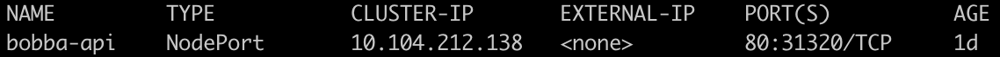

## Services API 🎒

Regarding our API (back-end) we're not required to deploy our API in a special port. This mean that we could use the ```NodePort``` withot any headache. Let's configured the service so that it will use the NodePort

## Configuration of the api service ⚒️

As always we're going to describe how the ```yaml``` file is. The original file is available in the ```k8s/services/api_service.yml``` folder

```yaml
kind: Service
apiVersion: v1
metadata:
  # This is the name of the service
  name: bobba-api
spec:
  # Type of service
  type: NodePort
  selector:
    # This should match the labels that defined your pods
    app: bobba-api
    tier: backend
  ports:
  # If no IP. Kubernetes will assign a random port
  - nodePort: 31320
    protocol: TCP
    # port expose to the cluster
    port: 80
    # Port of the pods
    targetPort: 8000
```

Now let's create our service

Create your service with this command

```shell
kubectl create -f k8s/services/api_service.yml
```

Now we need to check that our services is created and exposed our Nodes by running this command

```shell
kubectl get services
```

You should see the following outputs



Now you should be able to access to your service. Use the command below in order to retrieve the minikube IP

```shell
minikube ip
```

Then you are able to target the backend with this url with ```<minikube_ip>:port/{route}```

If you try to fetch a route like ```/bobbas``` you'll see that we have an error regarding our database. Indeed we haven't create our database yet ! Let's do it

#### Let's create our [database](database.md)

## Drawbacks 🔮

While it does what we want it does has some drawbacks. Moreover we also have theses drawbacks:

- One service per port
- Can only use port from 30000 - 32767
- If NodeIP change we need to deal with this
