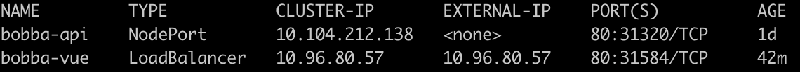

## Front service 🐥

As describe earlier a service allow you to group a certain number of pods in order to make them accessible to in different level. In the case of our Front we want it to be reachable from the outside. As our front-end is the main entry point to our system we want it to be able to reach it with a simple url on the port 80.

In order to expose our front deployment we could use 2 types of services

- ```NodePort```: NodePort is use for exposing the node's port to the cluster. However the NodePort is limited by which port we should use and unfortunately port 80 is not available.
- ```LoadBalancer```: The loadbalancer mode has the same advantages as the NodePort with one more advantage. The Loadbalancer allow us to use any port. However it required us to have an existing LoadBalancer provider

💡 Thanks to minikube. We could emulate a LoadBalancer by using the ```minikube tunnel``` command.

In our case as minikube provide a LoadBalancer out of the box we could use the LoadBalancer option for our deployment.

In order to create our *service* we only need one thing. A Yaml configuration file which is describe below:

## Configuration of the front service ⚒️

As always we're going to describe how the ```yaml``` file is. The original file is available in the ```k8s/services/front_service.yml``` folder

```yaml
kind: Service
apiVersion: v1
metadata:
  # Name of your service
  name: bobba-vue
spec:
  # Type of service
  type: LoadBalancer
  selector:
    # this should match the labels define in your pods
    app: bobba-vue
    tier: frontend
  ports:
    # No need to precise a special port. Minikube / GCP will create a load balancer on it's own.. at least on minikube :D
  - protocol: TCP
    port: 80
    targetPort: 8080
```

Pretty simple isn't it ? Let's create our service
Create your service with this command by running this command

```shell
kubectl create -f k8s/services/front_service.yml
```

Now we need to check that our services is created and exposed our Nodes by running this command

```shell
kubectl get services
```

As **minikube doesn't get access to GCP** we need to run the command ```minikube tunnel``` which will create our LoadBalancer

Now if you check the services again you should see an ```externalIP``` for our ```bobba-vue``` service !



#### Now let's check the API for our service [API Service](service_api.md)

## Drawbacks 🔮

While this method is useful in development mode. It might not be suitable for a production environment as every time you use the LoadBalancer mode a new LoadBalancer will be create. This operation can be quite expensive if you have many load balancer to create.