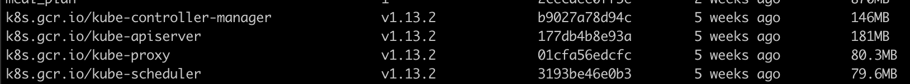

## Minikube

Minikube is a local Kubernetes environment which come with one cluster allowing you to test your deployment. It allow fast prototyping before deploying your app in real Kubernetes provider such as Google cloud console or Amazon EKS and many others...

### Install

In order to realize the deloyment example that we're going to do I highly suggest you to download minikube based on your operating system. [Download minikube](https://kubernetes.io/docs/tasks/tools/install-minikube/)

Minikube need an Hypervisor in order to work. Please check the hypervisor you need to install for your OS [List of hypervisor](https://kubernetes.io/docs/tasks/tools/install-minikube/#install-a-hypervisor)

> Note: The deployment example has been made by using Hypervisor. Choosing an other shouldn't change the behavior of minikube

Moreover you'll need to install the ```kubernetes-cli``` follow this guide for downloading the cli for your platoform: [guide](https://kubernetes.io/docs/tasks/tools/install-kubectl/)

## Starting Minikube 🤖

Starting minikube is simple just type the following command

```shell
minikube start
```

Secondly we're going to set the docker daemon to the minikube instance. On the same window run this command

```shell
eval $(minikube docker-env)
```

Now if you run

```shell
docker images
```

you should see the existing images within your kubernetes instance like some of them.



For the rest of the deployment example you shall **use this terminal / (window terminal)** and no other in order to not loose the docker daemon instance

## Troubleshootings

### Stuck at connection timed out on OSX

If you get an ```ssh error...: operation timed out ```
Locate the ```hyperkit.pid``` and delete it.

Below is an example on OSX:

```shell
rm -rf ~/.minikube/machines/minikube/hyperkit.pid
```