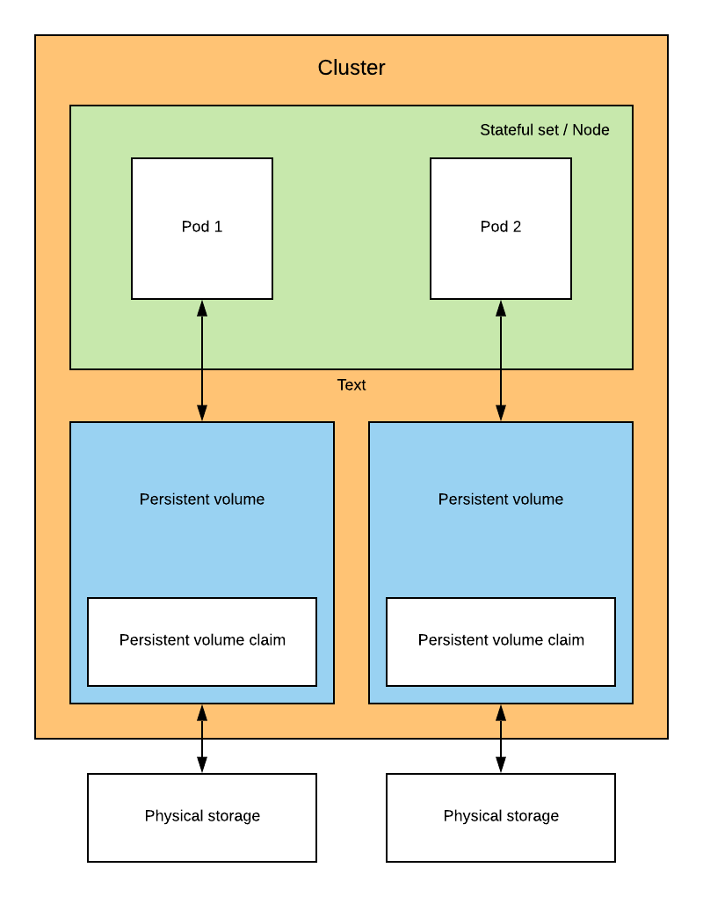

With Kubernetes and the StatefulSet deployment you are able to deploy stateful pods within your Cluster.

Deploying a Stateful application mean that this will involve a storage layer. Kubernetes provide a persistent volume API option for this kind of usage.

## How does it work

A Persistent Volume is a piece of storage located in the Cluster. As the Persistent volume isn't volatile as the Node & the pods. Persistent volume is the reason why it's located in the Cluster and not within a Node.

Kubernetes support the following types of storage [type of storage](https://kubernetes.io/docs/concepts/storage/volumes/#types-of-volumes)

Futhermore Persistent volume has a lifecycle. I suggest you to take a look at those [there](https://kubernetes.io/docs/concepts/storage/persistent-volumes/#lifecycle-of-a-volume-and-claim)

Below is how the architecture can be between a PV and a Node

<p align="center">
    
  <p align="center"><b>Representation of a statefulset with a storage</b></p>
</p>

## Types of Persistent volume 📁

There are 2 types of persistent volume. Below is the definition of each of them right from the Kubernetes documentation 

### Static 💿

Static provisioning allow a Cluster administrator to expose a set of persistent storage to the Cluster

> A cluster administrator creates a number of PVs. They carry the details of the real storage which is available for use by cluster users. They exist in the Kubernetes API and are available for consumption.

### Dynamic 🖥️

> When none of the static PVs the administrator created matches a user’s PersistentVolumeClaim, the cluster may try to dynamically provision a volume specially for the PVC. This provisioning is based on StorageClasses: the PVC must request a storage class and the administrator must have created and configured that class in order for dynamic provisioning to occur.

This dynamic solution remove a lot of headache regarding how to create, delete and size up your storage.

Moreover if you don't have a lot of knowledges in this field like me the writer 😅.

It's far better to let the Kubernetes engine do the allocation of storage for us

## Components

As we said in the section *How does it work*. The persistent claim (PV) is located in the Cluster.

In order to define the behavior of the Persistent volume, Kubernetes is using a PersistentVolumeClaim (PVC). This PVC allow us to define several options such as size, access-modes, labels.

While extensible if you need to have even more flexibility Kubernetes offer a deeper customization throught the ```StorageClass``` resources

## Access modes 🔏

Creating a storage required you to define an access mode to your storage. Currently there are **3 types** of access mode available

- ReadWriteOnce: a volume can be mounted as read-write by a single node
- ReadOnlyMany: a volume can be mounted read-only by many nodes
- ReadWriteMany: a volume can be mounted as read-write by many nodes

> ⚠️ From Kubernetes docs: A volume can only be mounted using one access mode at a time, even if it supports many. For example, a GCE Persistent Disk can be mounted as ReadWriteOnce by a single node or ReadOnlyMany by many nodes, but not at the same time.

## Resources

[Kubernetes storage introduction by IBM](https://console.bluemix.net/docs/containers/cs_storage_basics.html#kube_concepts)

[Kubernetes storage documentation](https://kubernetes.io/docs/concepts/storage/persistent-volumes/)

[Static or dynamic](https://cloud.netapp.com/blog/dynamic-kubernetes-persistent-volume-provisioning)


