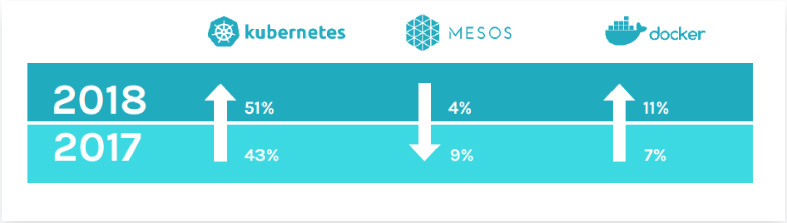

Previously we made our deployment with docker-compose locally. Regarding the production environment Docker offer the Swarm mode which allow you to orchestrate container just like Kubernetes & Mesos. However Swarm is lesser use than Kubernetes.

<p align="center">
  
</p>

Nevertheless it's interesting to understand the usage & the difference between Docker Swarm & Kubernetes

## A brief look of Docker swarm[¶](#a-brief-look-of-docker-swarm)

Docker Swarm is a container orchestrator that is ship by default with Docker. It aim to simplify the management of multiple containers just like what Kubernetes does.

At the core Docker Swarm is a master-slave architecture that contains a set of clusters consistings of a Docker engine that is deployed on multiples nodes. Manager nodes perform orchestration and cluster management while the worker nodes receive & execute tasks from the manager nodes.

In order to deploy an application to Docker Swarm. Docker offer one type of deployment which is the ```Service```. The service specify the container image to use, the number of wanted replicas.

> A service, which can be specified declaratively, consists of tasks that can be run on Swarm nodes. Services can be replicated to run on multiple nodes. In the replicated services model, ingress load balancing and internal DNS can be used to provide highly available service endpoints. (Source: Docker Docs: Swarm mode)

The service can be run in 2 different mode.

- Global: Services run on all nodes
- Replicated: Run services replicas accross all nodes. (name Task)

> Task: A task is an atomic unit of a Service scheduled on a worker node. In the example above, two tasks would be scheduled by a master node on two worker nodes (assuming they are not scheduled on the Master itself). The two tasks will run independently of each other.

For a complete list of feature that Swarm offer you can check this website [Docker swarm & Kubernetes comparaison](https://platform9.com/blog/kubernetes-docker-swarm-compared/)

TL;DR:

- Easy to use thanks to it's API
- Seemless integration with already known config e.g compose
- Ship out of the box with Docker

## Why using Kubernetes for this guide[¶](#why-using-kubernetes-for-this-guide)

As you can see on the graph. Kubernetes is much more popular than Docker Swarm. 

Futhermore, Docker Swarm hasn't been use to a lot of production environment with huge scale. Thus it's might be more interesting for you today, to learn Kubernetes.

While this learning guide will use Kubernetes for deploying our app into a so-called production environment. Docker swarm could be perfectly use for fast and small deployment.

## Resources[¶](#resources)

[Docker swarm & Kubernetes comparaison](https://platform9.com/blog/kubernetes-docker-swarm-compared/)

[the new stack docker swarm & kubernets comparaison](https://thenewstack.io/kubernetes-vs-docker-swarm-whats-the-difference/)

[Docker swarm doc](https://docs.docker.com/engine/swarm/)